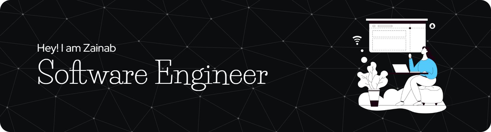

 ## About Me
I build scalable, user-friendly web applications with focus on writing clean, maintainable code and ensuring performance..  
I’m currently exploring machine learning for real-world applications and learning DevOps to better understand deployment and infrastructure.

 📫 You can reach me at    

##  Skills
### 💻 Languages & Databases  

  

### ⚙️ Frameworks, Tools & Technologies  

##  Stats

  
 

  

